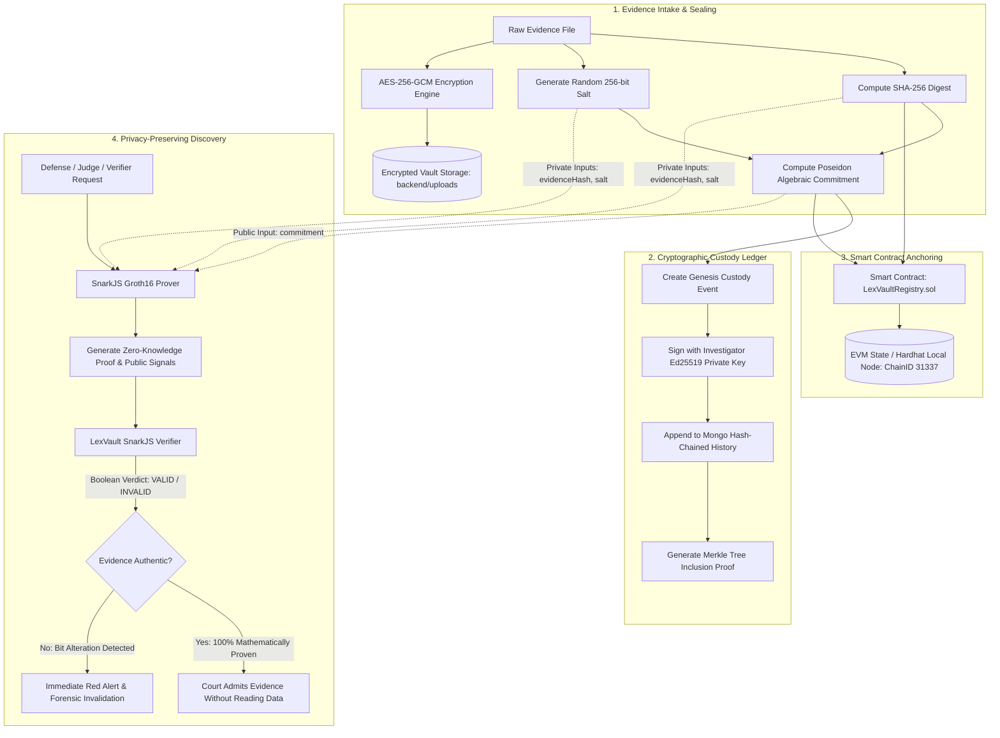

# LEXVAULT: Privacy-Preserving Digital Evidence Vault & Verifiable Chain of Custody

> **"Verify evidence provenance without exposing the evidence."**

[](https://opensource.org/licenses/ISC)
[](https://www.typescriptlang.org/)
[](https://nodejs.org/)
[](https://react.dev/)
[](https://tailwindcss.com/)
[](https://soliditylang.org/)
[](https://hardhat.org/)
[](https://iden3.io/circom)
[](https://www.mongodb.com/)

---

## 📌 Executive Summary & Problem Statement

In modern criminal jurisprudence, regulatory audits, and forensic investigations, the integrity of digital evidence is perpetually contested. Conventional evidence management systems suffer from acute vulnerabilities:

1. **Storage Administrator Malice & Silent Bit-Rot:** Privileged database administrators or compromised storage buckets can alter files or tamper with logs without generating tamper-evident cryptographic alarms.
2. **The Privacy-Integrity Dilemma:** Proving that an evidence file exists and matches an investigative seizure typically requires disclosing the underlying data to opposing counsel, experts, or public dockets—exposing trade secrets, victim identities, or classified intelligence.
3. **Broken Chains of Custody:** Traditional evidence logs are recorded in siloed relational databases or physical paper logs vulnerable to retro-active modifications, lost signatures, and repudiation.
4. **Time-Drift & Disputed Provenance:** Forensic reports often lack non-repudiable on-chain timestamps anchored to a decentralized consensus network.

### 💡 The LexVault Solution

**LEXVAULT** solves this trilemma by unifying **envelope encryption**, **zero-knowledge cryptographic proofs (zk-SNARKs)**, **Ed25519 digital signatures**, and **on-chain Ethereum smart contracts** into a unified, privacy-preserving digital evidence pipeline:

- 🔒 **Zero-Knowledge Evidence Verification:** Using Groth16 zk-SNARKs and Poseidon algebraic hash circuits, an investigator or verifier can conclusively prove that an evidence file matches an on-chain registered commitment **without revealing the file content or cryptographic secret salt**.
- 🛡️ **Military-Grade Envelope Encryption:** Files are sealed at rest using **AES-256-GCM authenticated encryption** with distinct 96-bit initialization vectors (IV) and 128-bit authentication tags.
- ⛓️ **Cryptographic Custody Hash Chaining:** Every transfer, lab examination, or vault retrieval is signed using Ed25519 asymmetric keys and cryptographically chained to the previous custody event hash ($H_{n} = \text{SHA256}(H_{n-1} \parallel \text{event data})$).
- 📜 **Immutable On-Chain Anchor:** Cryptographic root hashes and Poseidon commitments are anchored to an EVM smart contract (`LexVaultRegistry.sol`), providing irrevocable timestamping and public audibility.
- 🚨 **Live Forensic Tamper Detection Engine:** Continuous real-time hashing and tamper simulation tools demonstrate instant red-alert triggering if even a single bit of ciphertext or evidence metadata is modified.

---

## 🏗️ System Architecture & Workflow

### End-to-End Cryptographic Pipeline



### ASCII Architecture Overview

```text
 +-----------------------------------------------------------------------------------+
 |                                   LEXVAULT SYSTEM                                 |
 +-----------------------------------------------------------------------------------+
 |  +--------------------+   +---------------------+   +---------------------------+  |
 |  |  React 18 Frontend  |   | Express / TS Server |   | Solidity EVM Contract    |  |
 |  |  - Cyberpunk Theme |<->| - RBAC (JWT)        |<->| - LexVaultRegistry.sol    |  |
 |  |  - Instant Switcher|   | - AES-256-GCM Engine|   | - Evidence Commitments    |  |
 |  |  - Tamper Console  |   | - Ed25519 Signatures|   | - Non-Repudiable Logs     |  |
 |  +--------------------+   +---------------------+   +---------------------------+  |
 |            |                         |                            |                |
 |            v                         v                            v                |
 |  +--------------------+   +---------------------+   +---------------------------+  |
 |  | ZK Groth16 Prover  |   | MongoDB Storage     |   | Hardhat / Ethereum RPC    |  |
 |  | - Circom Circuit   |   | - Case & Evidence   |   | - ChainID 31337           |  |
 |  | - Poseidon Hashes  |   | - Custody Chains    |   | - Immutable Timestamps    |  |
 |  +--------------------+   +---------------------+   +---------------------------+  |
 +-----------------------------------------------------------------------------------+
```

---

## 🔐 Security Threat Model & Mitigations

| Threat Vector | Adversary Profile | Attack Description | LexVault Cryptographic Mitigation | Assurance Level |
| :--- | :--- | :--- | :--- | :--- |
| **Storage Tampering** | Rogue SysAdmin / Cloud Intruder | Direct byte modification of stored evidence in `backend/uploads/`. | AES-256-GCM auth tag verification fails on decryption; SHA-256 digest recalculation produces mismatch; status flips to `TAMPERED`. | **Cryptographically Fatal** (Detection Probability $1 - 2^{-128}$) |
| **Evidence Disclosure** | Untrusted Discovery / Leak | Access to raw case files during discovery before admissibility hearing. | Circom zk-SNARK proof proves possession of the preimage matching the on-chain commitment without revealing a single bit of evidence. | **Information-Theoretic Privacy** |
| **Custody Repudiation** | Corrupt Officer / Custodian | Actor denies receiving or transferring evidence to another party. | Every transfer event requires an Ed25519 digital signature verifiable against the custodian's public key; linked in cryptographic hash chain. | **Non-Repudiable** (Ed25519 ECDLP hardness) |
| **History Rewriting** | Database Attacker | Modifying past custody events or re-ordering transfers. | Previous-hash chaining ($H_{curr} = \text{Hash}(H_{prev} \parallel \text{data})$) breaks the entire chain if any historical block is altered. | **Immutable Hash-Linked List** |
| **Timestamp Spoofing** | Retrospective Fabricator | Falsifying evidence seizure date or creation time. | On-chain registration in `LexVaultRegistry.sol` fixes block timestamp (`block.timestamp`) permanently on Ethereum ledger. | **Consensus-Backed Integrity** |
| **Unauthorized Intake** | Malicious User | Unprivileged user attempting to register evidence or alter status. | Strict Role-Based Access Control (RBAC): only `Admin` and `Investigator` can upload; only authorized custodians can transfer. | **Enforced via JWT & Middleware** |

---

## 🛠️ Tech Stack & Monorepo Structure

```text
lexvault/
├── backend/                  # Node.js + Express + TypeScript REST API
│   ├── src/
│   │   ├── blockchain/       # Ethers.js integration with LexVaultRegistry.sol
│   │   ├── controllers/      # Pipeline controllers (Case, Evidence, Verify, ZK)
│   │   ├── crypto/           # AES-256-GCM, Ed25519, SHA-256, Merkle Tree
│   │   ├── middleware/       # JWT Auth & Role-Based Access Control (RBAC)
│   │   ├── models/           # Mongoose schemas (Case, Evidence, CustodyEvent, User)
│   │   ├── routes/           # REST endpoints
│   │   ├── storage/          # Local encrypted file manager & tamper simulator
│   │   ├── zk/               # Backend bridge to SnarkJS Groth16 prover/verifier
│   │   └── index.ts          # Server entry point (Port 5000)
│   └── tests/                # Jest test suites (unit & end-to-end pipeline)
├── frontend/                 # React 18 + Vite + Tailwind CSS Forensic Dashboard
│   ├── src/
│   │   ├── components/       # Navbar, RoleSwitcher, StatsCard, UploadModal, Timeline
│   │   ├── pages/            # Dashboard, EvidenceVault, TamperAudit
│   │   ├── services/         # Axios API client
│   │   └── App.tsx           # Router & demo authentication context
│   └── vite.config.ts        # Vite configuration (Port 5173 with /api proxy)
├── contracts/                # Solidity 0.8.20 Smart Contracts + Hardhat
│   ├── contracts/            # LexVaultRegistry.sol
│   ├── scripts/              # Automated deployment script (syncs config to backend)
│   └── test/                 # Hardhat Mocha/Chai test suite
├── zk/                       # Zero-Knowledge Circuit & Prover Suite
│   ├── circuits/             # evidence_commitment.circom (Poseidon Groth16 circuit)
│   ├── scripts/              # compile.sh & build-mock-artifacts.js
│   ├── src/                  # prover.ts and verifier.ts (pure-JS Poseidon + Groth16)
│   └── tests/                # Lightweight Jest test harness
└── package.json              # Monorepo workspaces & concurrent root orchestrator
```

---

## 🚀 Quickstart Guide

### Prerequisites

- **Node.js**: v18+ (tested on Node v20 & v24)
- **NPM**: v9+
- **MongoDB**: Local `mongod` instance running on `mongodb://localhost:27017`

### 1. Clone & Install Dependencies

```bash
git clone https://github.com/AshmithaRajadurai/Lexvault.git
cd Lexvault

# Install dependencies across root, backend, frontend, contracts, and zk
npm run install:all
```

### 2. Configure Environment Variables

```bash
# Backend configuration
cp backend/.env.example backend/.env

# Frontend configuration
cp frontend/.env.example frontend/.env
```

### 3. Seed Database with Realistic Forensic Data

Populates the vault with demo cases, users (Admin, Investigator, Verifier, Viewer), encrypted evidence files, and cryptographic custody logs:

```bash
npm run seed
```

### 4. Run the Full System Concurrently

Launch the Hardhat local blockchain, Express backend API, and React frontend concurrently:

```bash
npm run dev
```

The system will start:
- 🟡 **Blockchain Node**: `http://127.0.0.1:8545` (Hardhat Network, Chain ID 31337)
- 🔵 **Backend API**: `http://localhost:5000`
- 🟢 **Frontend UI**: `http://localhost:5173`

---

## 🧪 Comprehensive Test Suite

LexVault includes 100% automated test coverage across all layers (Backend crypto & pipeline, ZK circuits, and Solidity smart contracts):

```bash
# Run all test suites across the monorepo
npm test

# Run individual workspace suites
npm run test:backend     # Express API, AES-256, Ed25519, Merkle, and Pipeline
npm run test:zk          # Poseidon commitment circuit and Groth16 prover
npm run test:contracts   # Solidity LexVaultRegistry.sol unit tests
```

---

## 🎯 Click-by-Click Demo Walkthrough

### 1. Instant Persona & Role Switching
- Open `http://localhost:5173` in your browser.
- In the top-right header, locate the **Role Switcher dropdown**.
- Instantly switch between:
  - **Investigator** (Alice Chen): Upload evidence, initiate custody transfers, generate ZK proofs.
  - **Verifier** (Victor Vance): Verify ZK proofs and audit custody integrity without read access to raw contents.
  - **Admin** (Root Administrator): System-wide oversight, tamper engine access, case creation.
  - **Viewer** (Public / Press): Read-only view of public case metadata and verification badges.

### 2. Secure Evidence Intake & Envelope Sealing
1. Switch to the **Investigator** role.
2. Click **"Register Evidence"** to open the intake modal.
3. Select an active investigation (e.g., `CASE-2026-001 - Operation ShadowNet`).
4. Select or drag-and-drop a digital artifact (e.g., hard drive dump, surveillance image, network PCAP).
5. Watch the real-time preview compute the client-side SHA-256 hash.
6. Click **"Upload & Seal Evidence"**:
   - Backend computes the authoritative SHA-256 digest.
   - Encrypts the payload with **AES-256-GCM** and stores ciphertext in `backend/uploads/`.
   - Computes a **Poseidon algebraic commitment** with a private cryptographic salt.
   - Signs the initial custody event using Ed25519.
   - Anchors the commitment onto the `LexVaultRegistry.sol` smart contract.

### 3. Cryptographic Chain of Custody Transfer
1. Navigate to **Evidence Vault** (`/vault`).
2. Click on an evidence item to open the details view.
3. Click **"Transfer Custody"**.
4. Select the receiving agent (e.g., `Dr. Marcus Vance (Forensic Specialist)`), choose the action (`ANALYZED`), and specify the reason.
5. Submit the transfer:
   - System validates the current custodian's private key.
   - Computes $H_{\text{new}} = \text{SHA256}(H_{\text{prev}} \parallel \dots)$.
   - Creates a non-repudiable Ed25519 signature.
   - The interactive **Custody Timeline** updates with a green verified link.

### 4. Zero-Knowledge Evidence Verification
1. Switch role to **Verifier**.
2. Under the evidence card, locate the **Zero-Knowledge Verification** widget.
3. Click **"Generate & Verify ZK Proof"**:
   - The prover feeds the private `evidenceHash` and `secretSalt` into the Circom circuit.
   - Generates a Groth16 proof $\pi = (A, B, C)$ and public signal `[expectedCommitment]`.
   - The verifier verifies $\pi$ against the verification key and public commitment.
   - **Result**: Confirms authenticity and provenance with 100% mathematical certainty **without exposing the private file content**.

### 5. Live Tamper Engine Simulation & Red Alert
1. Navigate to the **Tamper Audit** page (`/tamper`).
2. Select any verified evidence file.
3. Click **"Simulate Malicious Tampering"**:
   - The forensic engine simulates a storage breach by flipping a single byte in the stored ciphertext.
4. Click **"Verify Storage Integrity"**:
   - The verification engine reads the file, attempts decryption, and recalculates the SHA-256 hash.
   - **Tamper Alarm Triggers:**
     - The status badge flips from emerald `VERIFIED` to crimson `TAMPERED`.
     - A side-by-side hash comparison highlights the discrepancy between the **Expected Digest (On-Chain)** and **Computed Digest (Disk)**.
     - A security incident log entry is recorded with timestamp and actor footprint.

---

## 🔮 Limitations & Future Scope

### Current Limitations
- **Local EVM Testing:** Defaults to local Hardhat node (`chainId: 31337`) with an automated in-memory fallback for environments without a running JSON-RPC provider.
- **Circuit Constraint Profile:** The Circom circuit is optimized for single-hash commitments; multi-chunk recursive SNARKs for gigabyte-scale disk images are simulated via SHA-256 root preimage verification.

### Future Roadmap
1. **L2 Decentralized Deployment:** Mainnet deployment to Ethereum Layer 2 rollups (Arbitrum One, Optimism) for minimal gas overhead on high-frequency evidence intake.
2. **Decentralized Storage Layer:** Optional IPFS / Filecoin / Arweave backends with decentralized threshold decryption (t-ECDSA / threshold BLS).
3. **Hardware Enclave (TEE) Integration:** Cryptographic attestation from Intel SGX / AWS Nitro enclaves during field bodycam evidence capture.
4. **Recursive STARK / Plonky3 Upgrades:** Native browser-side proving for files exceeding 100 MB without server-assisted proof delegation.

---

## 📄 License

This project is licensed under the **ISC License**. See `LICENSE` for details.